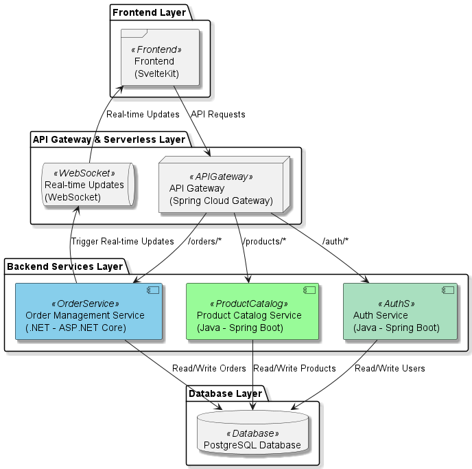

# E-commerce Platform

## Repositorios

- [Front](https://github.com/JohnCubides/Linktic-FrontSvelteKit): Front SvelteKit.
- [ApiGateway](https://github.com/JohnCubides/Linktic-ApiGateway): Gateway.
- [API de Autenticación](https://github.com/JohnCubides/Linktic-AuthService): Auth Service.
- [Api Product](https://github.com/JohnCubides/Linktic-ProductService): Product Service.
- [Api Order](https://github.com/JohnCubides/Linktic-OrderService): Order Service.



## Project Overview

This project is a simplified e-commerce platform designed to demonstrate basic functionalities in managing product catalogs and order management. The platform includes two key backend services and is built with flexibility, scalability, and maintainability in mind.

## Objective

Design and partially implement an e-commerce platform with the following key functionalities:
- **Product Catalog Management**: Manages product listings and product-related operations.
- **Order Management**: Handles the creation, management, and listing of orders.

The architecture can be based on microservices, serverless functions, or a hybrid approach depending on the strengths and needs of the project.

## 1. Backend

### 1.1. Product Catalog Service
- **Functionality**: Manages product listings, providing CRUD operations.
- **Implementation**: Built with Java (Spring Boot) as a RESTful service.
- **Database**: Connected to a PostgreSQL database to manage product data.
- **Deliverable**: Source code that follows RESTful principles with proper documentation and database interaction.

### 1.2. Order Management Service
- **Functionality**: Manages the creation and listing of orders.
- **Implementation**: Built with .NET (ASP.NET Core) as a RESTful service.
- **Database**: Integrated with PostgreSQL to manage orders and related information.
- **Deliverable**: Source code with RESTful design, database interaction, and proper testing.

## 2. Database Design

### Schema Overview
The database schema is designed to efficiently support both backend services with emphasis on the order management system’s scalability. The structure includes:
- **Products Table**: Contains information such as product name, description, price, and inventory count.
- **Orders Table**: Manages order details, linking each order to its customer and products.
- **Order Items Table**: Stores details of individual items within each order.

### Deliverable
- Documentation outlining the database structure, including data storage, access, and management strategies.
- Details for relational database (PostgreSQL) configuration.

## 3. DevOps (Pipelines)

### CI/CD Pipeline
A basic CI/CD pipeline is set up to automate the build, test, and deployment process for the backend services. The pipeline includes:
- **Build**: Automates building of the service to ensure code integrity.
- **Testing**: Runs unit and integration tests for each service.
- **Deployment**: Deploys the application to an Azure Web App environment.

### Pipeline Configuration
The pipeline configuration files (`.yml`) are stored in the `.github/workflows` directory and include:
- Simulated deployments for testing and validation.
- Version control management using GitHub Actions.

### Deliverable
- Pipeline configuration files (`deploy-to-azure.yml`) with a detailed explanation of each pipeline step.

## 4. Submission

All code and documentation are stored in a GitHub repository. The repository includes:
- **README.md**: Provides setup and operation instructions.
- **Swagger/OpenAPI**: API documentation accessible at `/swagger-ui`.
- **Postman Collection**: Collection for testing endpoints interactively.

### Deliverable
- Clear and comprehensive instructions for setting up and running the backend components.

## Bonus (Optional)

### App Planning (Architecture)
- High-level architecture diagram created using PlantUML, detailing backend components such as API Gateway, services, and database interactions.

### Cloud Design
- Simulated backend and database architecture using tools like LocalStack or a real deployment example on Azure/AWS.

### Frontend
- A simple frontend application using **SvelteKit** that interacts with backend services to display products and manage orders.

### Authentication
- User login and logout functionalities using JWT authentication integrated into the backend.

### Multiple Languages
- Implementation of one backend service or additional functionality using another programming language to demonstrate proficiency.

### Real-time Updates
- Implemented using **WebSockets** or **Server-Sent Events (SSE)** for real-time updates on order status.

### Git Usage
- Proper usage of microcommits and effective branching demonstrated throughout the project.

### API Documentation
- **Swagger** and **Postman** documentation provided for testing and interaction with backend services.

### Database Documentation
- Comprehensive database documentation including data models, relationships, and data access strategies.

## Evaluation Criteria

- **Backend and Database Design**: Focus on scalability, maintainability, and operational efficiency.
- **DevOps**: Completeness and effectiveness of the CI/CD pipeline, including deployment to cloud environments.
- **Bonus Deliverables**: Quality and innovation demonstrated in optional tasks such as frontend development, authentication, and real-time updates.

## Tips and Assumptions

- Document all design choices and assumptions clearly.
- Ensure that all components are easily runnable with clear setup instructions.
- Favor simplicity in design and implementation for clarity and maintainability.

## Getting Started

### Prerequisites
- **Java (Spring Boot)** and **.NET (ASP.NET Core)** environments set up.
- **PostgreSQL** installed and configured.
- **Node.js** and **npm** installed for frontend development.

### Installation

- [Front](https://github.com/JohnCubides/Linktic-FrontSvelteKit): Front SvelteKit.
- [ApiGateway](https://github.com/JohnCubides/Linktic-ApiGateway): Gateway.
- [API de Autenticación](https://github.com/JohnCubides/Linktic-AuthService): Auth Service.
- [Api Product](https://github.com/JohnCubides/Linktic-ProductService): Product Service.
- [Api Order](https://github.com/JohnCubides/Linktic-OrderService): Order Service.

### Running the Application

1. **Start Backend Services**:
   ```bash
   dotnet run --project ./OrderService
   mvn spring-boot:run -f ./ProductCatalogService
   ```

2. **Access the Frontend**:
   - Go to `http://localhost:3000` to access the application.

## Contact

For questions or support, please contact [John Cubides] at [john.cubides87@gmail.com].
